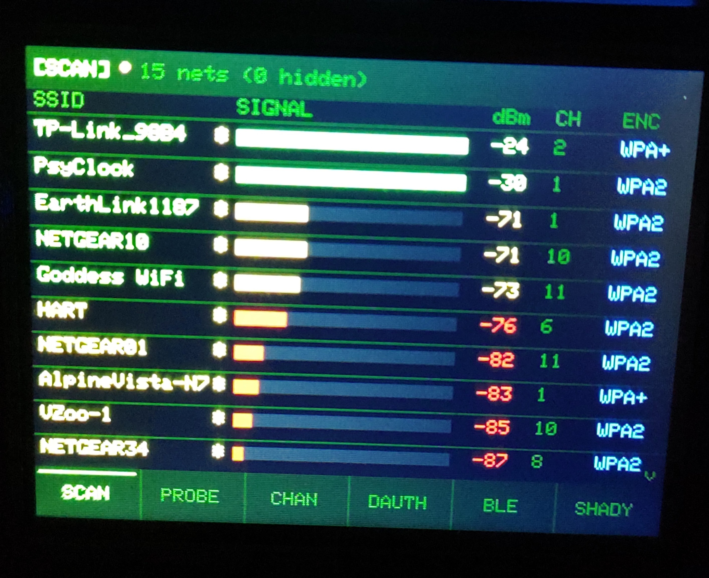
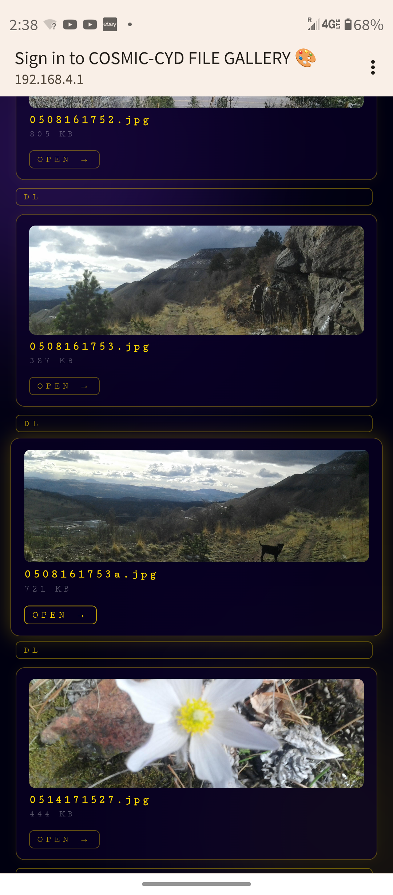
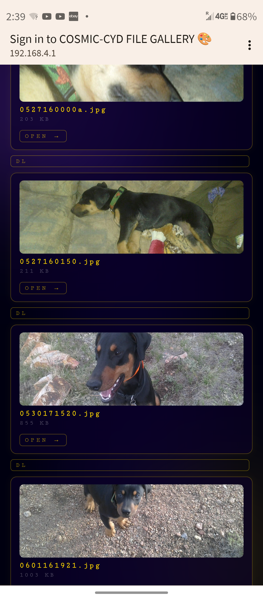

# CosmicCYD Scanner 🎨📡

An **ESP32 CYD** firmware that merges two projects into one:
- **COSMIC-CYD** — WiFi captive portal art gallery (72+ generative art modes, SD card file share, guestbook, pet)
- **CYD WiFi Scanner** — 802.11 security scanner (network scan, probe sniffer, deauth detector, shady network analyzer)

Power it on. It runs as an art portal. When no one is connected it drops into **WiFi Scanner screensaver mode** — scanning the airwaves until a visitor shows up, then seamlessly returning to the portal.

> **Hardware:** ESP32-2432S028R (CYD) · ILI9341 320×240 touchscreen · XPT2046 touch · RGB LED · SD card (optional)

---

## Photos

### Portal running on the CYD


### WiFi Scanner modes
| SCAN Mode | PROBE / SHADY Mode | DAUTH Mode |
|---|---|---|
|  | 

### Captive portal — phone prompt & portal pages




---

## What it does

### Portal (always on)
Power it on and your phone sees a WiFi AP called **`COSMIC-CYD FILE GALLERY 🎨`**. Connect and you are automatically redirected to the portal. From there:

- **Browse & download files** from the SD card — images, ZIPs, PDFs, videos, anything you put on there
- **Explore 72+ generative art & animation modes** running entirely in the browser — no app, no install
- **Read the Free WiFi Safety PSA** — plain-English guide on evil portals and how to stay safe
- **Sign the guestbook** — message shows up on the CYD display
- **Pet** — a persistent on-device creature that needs attention

The CYD display shows SSID, IP, live visitor count, and SD status. The RGB LED pulses at idle and flashes when someone connects.

### WiFi Scanner (screensaver when idle)
When **no visitor is connected**, if you have selected the **📶 WIFI SCANNER** screensaver in the portal settings, the CYD drops into scanner mode. Four modes accessible via the touch footer bar:

| Tab | Mode | Description |
|-----|------|-------------|
| `SCAN` | WiFi Network Scanner | Synchronous scan showing all nearby networks sorted by RSSI — SSID, signal bar, dBm, channel, encryption |
| `PROBE` | Probe Request Sniffer | Promiscuous mode capture of 802.11 probe requests — shows source MAC + requested SSID in real time |
| `DAUTH` | Deauth Attack Detector | Monitors for 802.11 deauth/disassoc frames, computes per-BSSID rate, alerts (red LED flash) on attack threshold |
| `SHADY` | Shady Network Analyzer | Scans for suspicious networks — open, hidden, evil twin / PineAP-style, SSID spam |
| `EXIT` | Return to portal | Exits scanner and returns to normal portal display |

When a visitor connects to the AP, the scanner exits automatically and the portal takes over.

---

## Selecting the WiFi Scanner screensaver

1. Connect to the CYD's WiFi AP
2. Open the portal (`192.168.4.1`)
3. Tap **⚙ Settings → Screensaver**
4. Select **📶 WIFI SCANNER**
5. Disconnect — within a few seconds the scanner starts

---

## Build & Flash

### Requirements
- [PlatformIO](https://platformio.org/) (VS Code extension or CLI)
- ESP32-2432S028R (CYD board)

### Build
```bash
cd CosmicCYDScanner
pio run
```

### Flash
```bash
pio run --target upload
```

Or use the PlatformIO **Upload** button in VS Code.

### Partition scheme
Uses `huge_app` partition table (required — firmware is ~1.3 MB). This is already set in `platformio.ini`.

---

## SD Card (optional)

Format the SD card as **FAT32**. Drop any files you want to share into the root. The portal will list and serve them automatically.

For the SD card image screensaver, place a JPEG named `ssaver.jpg` in the root.

---

## Gallery password lock 🔒

> ⚠️ If your SD card has sensitive files, set a password after flashing. The gallery is open by default.

Create a file `/sdpass.txt` on the SD card containing your password. Any visitor trying to open the gallery will be shown a login screen first.

---

## External IPEX Antenna (optional hardware mod)

If your CYD board includes an IPEX connector you can swap to an external antenna for better range. This is a **hardware-only** change — no firmware modification needed.

### Background

By default, most CYD boards are configured for the on-board PCB trace antenna. Near the ESP32 module there is a tiny 0-ohm resistor / solder jumper that selects the antenna path, usually labeled:

- `ANT`
- or `R0` / `R1` (very small RF jumper)

There are two pad positions — one for the PCB antenna, one for the IPEX connector.

### Steps

1. Locate the small RF jumper next to the antenna/IPEX area on the board.
2. Remove the solder bridge (or 0-ohm resistor) from the **PCB antenna** position.
3. Bridge the pads for the **IPEX / external antenna** position.
4. Connect your IPEX antenna.

That's it. The ESP32 will now use the external antenna instead of the on-board trace antenna.

> ⚠️ **Important:** Do not leave both antenna paths bridged. Only one path should be connected at a time (PCB or IPEX). This is a hardware-only change and does not require any firmware modification.

---

## Notes

- The portal AP stays alive while the scanner runs — WiFi mode is `WIFI_AP_STA`
- Scanner auto-exits when a visitor connects; auto-enters when they disconnect
- BLE was intentionally excluded — it crashed the device in AP_STA mode
- Channel Analyzer was intentionally excluded — channel hopping is not possible while the AP is active (ESP32 hardware limitation)
- SD card logging is supported in scanner modes (PROBE, DAUTH, SHADY events written to SD)

---

## Related projects

- [CosmicCYD](../CosmicCYD) — the original portal-only firmware
- [CYDWiFiScanner](../CYDWiFiScanner) — the original standalone scanner firmware
